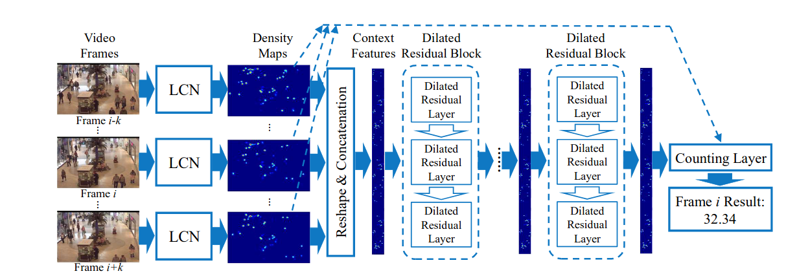
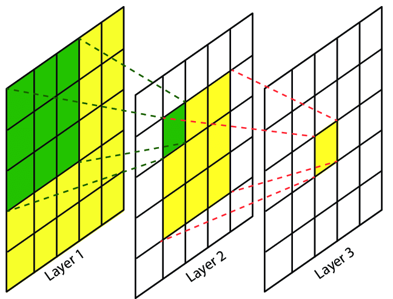

# Data
### <a href=http://www.cvg.reading.ac.uk/PETS2009/a.html__>PETS 2009 benchmark data</a>

# Zdroje

### [paperswithcode.com](https://paperswithcode.com/task/crowd-counting)
- soubor článků i s __odkazy na GitHub__
- jsou tam i odkazy na __datasety__, na kterých jsou řešení testována
- submitnuté detektory jsou testovány na zveřejněných datasetech a řazeny podle úspěšnosti

### [A Method for Counting Moving People in Video Surveillance Videos](https://asp-eurasipjournals.springeropen.com/articles/10.1155/2010/231240)
- Dva přístupy
  - direct (detection based)
    - lidé jsou v obraze detekování (nějakou formou segmentace a detekce objektů) a následně spočítáni  
    - [1]
      - systém odstraní pozadí a následně se snaží matchovat modely lidí s hranami v popředí (Expectation-Maximization algorithm)
      - limitace na nízký počet lidí v "davu"
    - [2]
     - v obraze jsou detekovány příznaky, které jsou trackovány mezi jednotlivými snímky
     - následně dochází ke seskupování bodů do skupin pomocí "Bayesian framework, under the assumption that pairs of points belonging to a same person have a small variance in their mutual distance (quasi-rigid motion)"
     - funguje i s početnějšími davy
     - problémy, dochází-li k pohybu od/ke kameře
   - [3]
    - použití 3D modelu reprezentovaného elipsoidy (hlava, torso, končetiny)
    - použití metody Monte Carlo s pomocí Markovových řetězců k provedení globální optimalizace
      - je to použito na několik snímků
    - dobré na málo a středně zalidněné záběry
    - výpočetně náročné
 - indirect (map based/measurement based)
   - počítání probíhá na základě měření jiné featury, která nevyžaduje detekování jednotlivých osob ve scéně
   - robustnější, jelikož správná detekce všech osob v obraze je ošemetná
     - detekce je problematická například v davu
   - množství pohybujících se pixelů
   - blob size ???
   - dimenze fraktálu??
   - texture features
   - [8] Albiol
    - nejlepší výsledky na PETS2009
    - využití rohů jako feature pointů - Harrisův detektor rohů
    - odstranění rohů patřících pozadí - nějaké prahování na základě velikosti pohybových vektorů mezi jednotlivými snímky
    - počet lidí je odhadnut na základě počtu rohů v obraze - direct corellation
     -  __smoothed mezi několika snímky__
- navržená metoda
  - podobná Albiolovi
  - snaží se opravit její omezení
    - místo Harrisova detektoru se používají SURF příznaky
      - nezávislé na rotaci a škále objektu
    - snaží se brát v potaz hustotu detekovaných příznaků
      - množství okluzí je zvislé na hustotě lidí v obraze
        - málo lidí -> je nepravděpodobné, že dojde k nějaké okluzi
        - moc lidí -> budou se vzájemně překrývat
      - je ale důležité brát v potaz perspektivu
        - stejný počet příznaků blízko kamery může být mnohem méně lidí, než daleko od kamery
        - dochází k seskupování příznaků do skupin
            - vzdálenost clusteru od kamery je odvozena pomocí vzdálenosti nejnižšího a nejvyššího bodu clusteru
    - počet lidí v obraze nyní nekoreluje přímo k množství příznaků
      - není to lineární funkce
      - místo toho je použit estimátor
        - SVR (support vector regressor), založeno na SVM
        - vstup počet příznaků
        - výstup odhad počtu lidí
    - výslede je podobně jako u Albiola protažen low pass filtrem, takže je výsledná funkce v "smoothed" v čase
  - detekce bodů zájmu
    -  předpokládáme, že i klidní lidé se trochu hýbou
      - zajímají nás pouze body s nenulovým pohybovým vektorem
- počítají s tím, že pohybující se příznaky musí patřit lidem
    - hrozí, že výsledky budo ovlivněny projíždějícími auty a jinými pohyby v obraze
    - buď přidat nějakou validaci, že body opravdu patří člověku, nebo použít jinou formu extrakce davu z obrazu (např použít konvoluční neuronovou síť, která bude detekovat, kde se v obraze nachází, či nenachází dav a tímto segmentovat obraz) samotný počet lidí v obraze potom počítat jiným způsobem

### [Fast Video Crowd Counting with a Temporal Aware Network](https://arxiv.org/pdf/1907.02198.pdf)
- snaží se využít "_Temporal relation_"
    - mezi snímky ve videosekvenci je vztah, jeden v čase předchází druhému
    - snaha nevycházet pouze z jednotlivých snímků
    - může to pomoci proti chybám způsobených šumem
    - jejich experimenty ukazují, že to má lepší výsledky, než metody, které vztahy mezi snímky ignorují
- použití "_Temporal Aware Network_ (TAN)"
    - dynamicky modeluje tempolní vlastnosti ve videosekvenci
    - složená ze dvou částí
     1. Light Convolutional Network (LCN)
        - schopná rychle zpracovat počítací úkoly - WUT??
        - garantuje rychlost s určitou přesností detekce/výsledného počtu
     2. multiple block architecture pro Temporal modeling ??
        - zabývá se modelováním temporálních vztahů v čase
        - každý _dilated_(rozšířený) používá set temporálních konvolucí ??, které upadtují odhad pro jednotlivé snímky na základě sousedních snímků
    - použítí density map
        - sousední snímky mohou mít rozdílný vizuální obsah, kvůli okluzím a pozadí (co tím myslí??)
        - sousední density mapy stále ukazují více podobého obsahu mezi sousedními snímky
        - ukazují hustotu/rozložení lidí
    
- podobné práce
    - mapování počtu příznaků na počet lidí (A Method for Counting Moving People in Video Surveillance Videos)
    - použítí konvolučních neuronových sítí
        - [6] - CNN s různě velkými konvolucemi - pomáhá s rozdíly v hustotě v obraze
            - způsobeno perspektivou
    - ...
- architektura
    - __TAN__
        - používá "_dilated_" konvoluce
            - protože zpracování snímku trvá dlouho a datasety jsou omezené
        - zajímá je spíše vztahy mezi heat mapami, než vztahy mezi jednotlivými snímky
            - vektory heat map jsou konkatanovány a použíty jako vstupní vektor pro další použití
                - používám předcházející i následující snímky
        - __LCN__
            - slouží k extrakci hustotní mapy z obrazu
        - Reshape and concatenation unit
            - předělá density mapu MxN na jednodimenzionální vektor
        - Dialated Residual Blocks
            - __The group of dilated residual block use the previous stage initial the next stage and use the next stage refines the previous stage.__
                - OMG WTF ????

### [Encoder-Decoder Based Convolutional Neural Networks with Multi-Scale-Aware Modules for Crowd Counting](https://arxiv.org/pdf/2003.05586v5.pdf)
- mám to z [paperswithcode.com](https://paperswithcode.com/task/crowd-counting) (dobré výsledky)
- má to i dostupnou [implementaci](https://github.com/Pongpisit-Thanasutives/Variations-of-SFANet-for-Crowd-Counting)
- __Introduction__
    - v novějších řešeních jsou zdárně použity Konvoluční neuronové sítě k vytvoření přesných Density Map lidí v obraze
        - to pomáhá s rozdílnou distribucí lidí napříč obrazem
            - perspektiva totiž znamená, že skupiny dále od kamery budou vypadat o dost jinak, než skupiny blízko, což způsobuje, že přesná detekce je problematická    
        - předchozí práce používaly _multi-column/multi-resolution_ architekturu sítí aby tento problé řešily
            - _MCNN_ - multi-column neural net?
            - podle [9] jsou ale příznaky, které se jednotlivé sloupce naučí, skoro identické a trénování takovéto sítě, která je už trochu více hluboká, začíná být náročné
                - proto tam ([9]) navrhují single column síť založenou na VGG16 Enkóderu/Dekodéru používající dilatované konvoluce
                    - __breakthrough__ v počítání na ShanghaiTech datasetu
        - [12] poukazuje na to, že velikost políčka (předpokládám, že té konvoluce) by se mělo napříč obrazem rozdílem, právě kvůli změně perspektivy
            - vytvořili scale-aware contextual module _CAN_ (context Aware Net)
                - dokáže získávat příznaky napříč několika velikostmi _receptive fields_ (oblast, ze které se získá hodnota políčka v další vrstvě CNN)
                
                - nepoužívají žádné mechanismy pro redukci šumu - může dojít k zanesení chyb
    - překrývání objektů
        - nejen problém při sčítání davu, ale také při segmentaci obrazu
            - pro tento účel byly navrženy jiné _scale aware_ moduly určené pro získání kontextuálních informací při různých velikostech
                - _SPP_ (spatial pyramid pooling)
                - _ASSP_ (atrous spatial pyramid pooling)
        - CNN mají i dobré výsledky u segmentace
            - použití architektury Enkodér-Dekodér
                - takovéto sítě byly navženy i pro počítání lidí v obraze
- __Proposed approach__
    - dva přístupy
        - oba založené na architektuře Enkodér-Dekodér
    - ___M-SFANet___
        - modifikovaná síť _SFANet_
        - vstup projde dekodérem
            - _dual path multiscale fusing decoder_
            - zjistí se důležité _high level semantics_
        - násldně jsou feature mapy vloženy do _multi scale aware_ modulů
            - _ASSP_ a _CAN_
        - výstupy obou cest dekodéru jsou sloučeny a pomocí bilineárního upsamplingu jsou _multi scale_ příznaky sloučeny do density map a attention map
        - pak jsou pomocí attention map segmentovány davy od pozadí
    - ___yM-SegNet___
        - modifikovaná síť _SegNet_
        